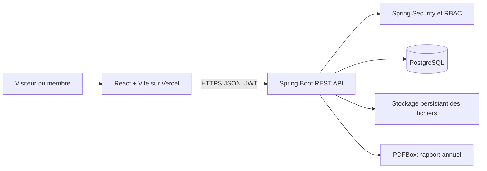

# Explication du code - LIAS Lab Manager

## Architecture

Le frontend ne parle jamais directement a PostgreSQL. Il appelle les routes REST du backend. Le backend valide l'identite, les droits et les donnees, execute la logique metier, puis utilise les repositories JPA.

## Dossiers importants

| Emplacement | Role |
|---|---|
| `frontend/src/App.jsx` | Routes React, pages publiques, portail, formulaires et appels Axios |
| `frontend/src/data/liasData.js` | Donnees publiques et contenu institutionnel LIAS |
| `backend/src/main/java/ma/lias/controller` | Endpoints HTTP `/api/...` |
| `backend/src/main/java/ma/lias/service` | Regles metier, audit, fichiers, rapport PDF |
| `backend/src/main/java/ma/lias/entity` | Objets persistants JPA |
| `backend/src/main/java/ma/lias/repository` | Acces aux donnees avec Spring Data |
| `backend/src/main/java/ma/lias/security` | Creation et verification des JWT |
| `backend/src/main/java/ma/lias/config/SecurityConfig.java` | Autorisations par methode, route et role |
| `backend/src/main/java/ma/lias/config/DataLoader.java` | Jeu de demonstration cree sur une base vide |
| `backend/src/main/resources/db/migration` | Versions SQL Flyway `V1` a `V4` |

## Flux de connexion

1. `Login` envoie email et mot de passe a `POST /api/auth/login`.
2. `AuthController` normalise l'email, verifie le hash BCrypt et l'etat `ACTIVE`.
3. `JwtService` cree un access token court et un refresh token.
4. L'access token est envoye dans `Authorization: Bearer ...` par l'intercepteur Axios.
5. Le refresh token est un cookie `HttpOnly`, `Secure` en production.
6. `JwtAuthenticationFilter` reconstruit l'utilisateur pour Spring Security.
7. `SecurityConfig` et `@PreAuthorize` refusent les roles non autorises.

## Organisation du backend

Le schema suivi est **Controller -> Service -> Repository -> PostgreSQL**.

- Le controller traduit HTTP vers des objets Java et renvoie le bon statut.
- Le service applique la regle metier, par exemple verifier le directeur actif ou conserver l'historique.
- Le repository fournit les operations de recherche et de persistence.
- L'entite definit la table, les colonnes et les relations persistantes.
- `AuditService` enregistre les actions sensibles avec acteur, entite, date et details.

## Exemple complet : accepter une adhesion

1. Le candidat envoie un `multipart/form-data` avec profil, motivation et CV.
2. `MembershipRequestController` enregistre une demande `PENDING` et le CV.
3. La liste est accessible a la direction.
4. A la decision, le backend verifie que l'utilisateur est le directeur du mandat actif.
5. En cas d'acceptation, il cree `User`, `Member`, `Affiliation` et `RoleHistory`.
6. Il passe la demande a `ACCEPTED`, cree une notification et ajoute une entree d'audit.
7. Les anciennes demandes et leurs motifs restent consultables.

## Modele de donnees a savoir expliquer

- `User` : email, mot de passe hashe, role applicatif, etat du compte.
- `Member` : profil scientifique et statut du membre.
- `Affiliation` : periode d'appartenance au laboratoire.
- `RoleHistory` : responsabilite et intervalle de validite.
- `Mandate` et `TeamChief` : gouvernance du laboratoire et des equipes.
- `Event`, `DocumentRecord`, `Publication` : activite et production scientifique.
- `Message` : type global/direct/equipe/evenement et destinataires associes.
- `MaterialInventory`, `MaterialRequest`, `MaterialDistribution` : stock, besoin et attribution.
- `Meeting`, `Convention`, `Notification`, `AnnualReport`, `AuditLog` : memoire institutionnelle.

## Frontend

`BrowserRouter` associe chaque URL a un composant. `Protected` verifie l'utilisateur et son role avant l'affichage. `PortalLayout` calcule le menu autorise pour le role connecte. Les formulaires utilisent Axios et affichent les erreurs du backend; les listes se rechargent apres chaque action.

La navigation du doctorant est volontairement reduite. L'admin dispose d'un back-office technique distinct. Le directeur dispose des workflows fonctionnels, notamment les adhesions et le rapport annuel.

## Base de donnees et migrations

- `V1__init.sql` cree le schema principal.
- `V2__cahier_completion_fields.sql` complete les profils et historiques demandes.
- `V3__workflow_archive_and_material_fields.sql` ajoute archives, decisions et materiel.
- `V4__message_channels.sql` ajoute les canaux direct, equipe et evenement.

Flyway applique chaque version une seule fois et enregistre la version courante. Cela permet de deployer une nouvelle version sans reconstruire manuellement la base.

## Tests et verification

- `frontend/src/App.contract.test.jsx` controle les exigences fonctionnelles et les contrats d'API.
- `frontend/src/App.test.jsx` couvre les composants et routes essentielles.
- `backend/src/test/.../CahierWorkflowContractTests.java` verifie les regles du cahier des charges.
- `LiasLabManagerApplicationTests` demarre le contexte Spring avec H2.
- La validation finale demarre aussi une vraie base PostgreSQL vide, applique Flyway, charge les comptes et teste les workflows en HTTP.

Resultat de la version remise : **39 tests frontend et 7 tests backend reussis**, build Vite reussi, image Docker Spring Boot reussie et rapport PDF valide.
